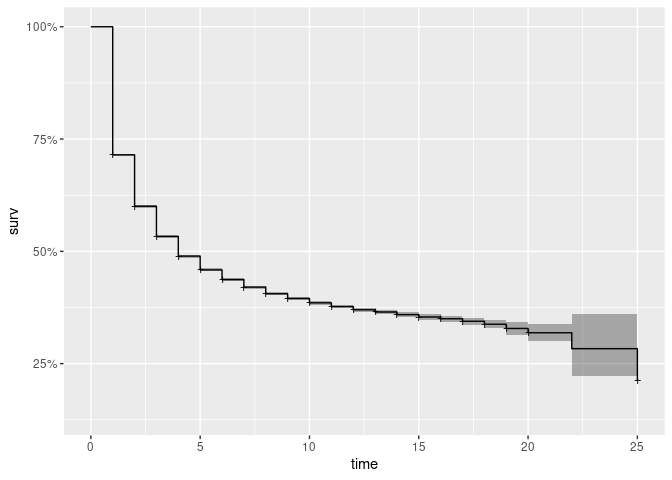
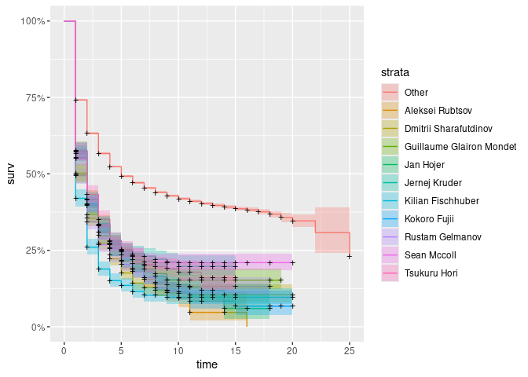
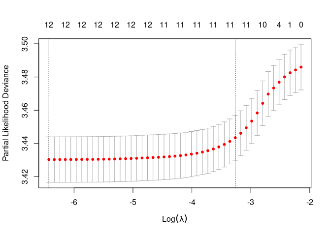

boulder2vec
================
2024-06-26

# Summary

Rating models can give us a good comparison of the relative strength of
different climbers. However, some climbers might have different
skills/specialties (e.g more powerful, more technical, more flexible),
and so they might excel at particular types of boulders. To identify
these specialties, we need to build a multi-dimensional representation
for each climber (AKA a vector embedding).

Unfortunately, we don’t have any information about the attributes of
each boulder (e.g. we don’t know that a given boulder is very
technical). Therefore, we will have to learn these multi-dimensional
representations automatically from the data. One way to do this is with
probabilistic matrix factorization (PMF), a technique commonly used for
recommender systems.

The goal is to learn representations with probabilistic matrix
factorization, and show that: (A) these representations are more
predictive than a benchmark rating model/unidimensional representation
(B) the multidimensional embeddings capture some aspect of climber
specialties (we need some domain knowledge to validate this). For the
benchmark model, I suggest a generalized linear model with climber
coefficients.

## (Possibly) Relevant Literature

Interesting blog on modelling amateur climbers:
<https://www.ethanrosenthal.com/2022/04/15/bayesian-rock-climbing/>

Analysis whose data we’re using:
<https://davidbreuer.github.io/ifsc-analysis/>

## Data Preparation

``` r
url = "https://github.com/DavidBreuer/ifsc-analysis/raw/main/ifsc_Boulder.xlsx"
df = read.xlsx(url, sheet=1)

str(df)
```

    ## 'data.frame':    19436 obs. of  27 variables:
    ##  $ Unique     : chr  "2007;Boulder;Boulder IFSC Climbing Worldcup (B) - Erlangen (GER) 2007 Erlangen 30 - 31 Mar;M;Q;Result" "2007;Boulder;Boulder IFSC Climbing Worldcup (B) - Erlangen (GER) 2007 Erlangen 30 - 31 Mar;M;Q;Result" "2007;Boulder;Boulder IFSC Climbing Worldcup (B) - Erlangen (GER) 2007 Erlangen 30 - 31 Mar;M;Q;Result" "2007;Boulder;Boulder IFSC Climbing Worldcup (B) - Erlangen (GER) 2007 Erlangen 30 - 31 Mar;M;Q;Result" ...
    ##  $ Year       : chr  "2007" "2007" "2007" "2007" ...
    ##  $ Discipline : chr  "Boulder" "Boulder" "Boulder" "Boulder" ...
    ##  $ Competition: chr  "Boulder IFSC Climbing Worldcup (B) - Erlangen (GER) 2007 Erlangen 30 - 31 Mar" "Boulder IFSC Climbing Worldcup (B) - Erlangen (GER) 2007 Erlangen 30 - 31 Mar" "Boulder IFSC Climbing Worldcup (B) - Erlangen (GER) 2007 Erlangen 30 - 31 Mar" "Boulder IFSC Climbing Worldcup (B) - Erlangen (GER) 2007 Erlangen 30 - 31 Mar" ...
    ##  $ Gender     : chr  "M" "M" "M" "M" ...
    ##  $ Level      : chr  "Q" "Q" "Q" "Q" ...
    ##  $ Group      : chr  "Result" "Result" "Result" "Result" ...
    ##  $ Name       : chr  "Stéphan Julien" "Gareth Parry" "Nalle Hukkataival" "Gérome Pouvreau" ...
    ##  $ Number     : chr  "32" "26" "10" "36" ...
    ##  $ Country    : chr  "FRA" "GBR" "FIN" "FRA" ...
    ##  $ Top1       : chr  NA NA NA NA ...
    ##  $ Zone1      : chr  NA NA NA NA ...
    ##  $ Top2       : chr  NA NA NA NA ...
    ##  $ Zone2      : chr  NA NA NA NA ...
    ##  $ Top3       : chr  NA NA NA NA ...
    ##  $ Zone3      : chr  NA NA NA NA ...
    ##  $ Top4       : chr  NA NA NA NA ...
    ##  $ Zone4      : chr  NA NA NA NA ...
    ##  $ Top5       : chr  NA NA NA NA ...
    ##  $ Zone5      : chr  NA NA NA NA ...
    ##  $ Route1     : num  NA NA NA NA NA NA NA NA NA NA ...
    ##  $ Route2     : num  NA NA NA NA NA NA NA NA NA NA ...
    ##  $ Run1       : num  NA NA NA NA NA NA NA NA NA NA ...
    ##  $ Run2       : num  NA NA NA NA NA NA NA NA NA NA ...
    ##  $ Run3       : num  NA NA NA NA NA NA NA NA NA NA ...
    ##  $ Run4       : num  NA NA NA NA NA NA NA NA NA NA ...
    ##  $ Run5       : num  NA NA NA NA NA NA NA NA NA NA ...

``` r
data_clean = tibble(df) |>
  # Get rid of columns we don't need
  select(-c(Unique, Discipline, Number, Group), -matches("Route|Run")) |>
  # Capitalize climber names consistently
  mutate(Name = str_to_title(Name)) |>
  # "Unpivot" so it's one row per climber-problem
  # I'm treating tops and zones as separate problems even though there's obviously a correlation
  pivot_longer(
    Top1:Zone5,
    names_to = "problem",
    values_to = "attempts",
    values_drop_na = TRUE,
  ) |>
  mutate(attempts = as.integer(attempts)) |>
  # Keeping only guys for now
  filter(Gender == "M") |>
  # Only keep boulders that at least one climber topped
  filter(any(is.finite(attempts)), .by = c(Competition, Level, problem)) |>
  # For anyone who failed to top the climb, we'll set their number of attempts to whatever
  # the maximum observed number of attempts was for that climb
  mutate(max_attempts = max(attempts, na.rm = TRUE), .by = c(Competition, Level, problem)) |>
  # Survival model features
  mutate(
    status = !is.na(attempts), # TRUE if they succeeded
    time = ifelse(is.na(attempts), max_attempts, attempts)
  ) |>
  # Keep climber name only for climbers with lots of data, use "Other" as replacement level
  mutate(climber = ifelse(n() >= 1000, Name, "Other"), .by = Name) |>
  mutate(climber = relevel(factor(climber), "Other"))
```

    ## Warning: There was 1 warning in `mutate()`.
    ## ℹ In argument: `attempts = as.integer(attempts)`.
    ## Caused by warning:
    ## ! NAs introduced by coercion to integer range

``` r
str(data_clean)
```

    ## tibble [95,234 × 12] (S3: tbl_df/tbl/data.frame)
    ##  $ Year        : chr [1:95234] "2008" "2008" "2008" "2008" ...
    ##  $ Competition : chr [1:95234] "Boulder IFSC Climbing Worldcup (B) - Hall (AUT) 2008 HALL 18 - 19 Apr" "Boulder IFSC Climbing Worldcup (B) - Hall (AUT) 2008 HALL 18 - 19 Apr" "Boulder IFSC Climbing Worldcup (B) - Hall (AUT) 2008 HALL 18 - 19 Apr" "Boulder IFSC Climbing Worldcup (B) - Hall (AUT) 2008 HALL 18 - 19 Apr" ...
    ##  $ Gender      : chr [1:95234] "M" "M" "M" "M" ...
    ##  $ Level       : chr [1:95234] "Q" "Q" "Q" "Q" ...
    ##  $ Name        : chr [1:95234] "Dmitrii Sharafutdinov" "Dmitrii Sharafutdinov" "Dmitrii Sharafutdinov" "Dmitrii Sharafutdinov" ...
    ##  $ Country     : chr [1:95234] "RUS" "RUS" "RUS" "RUS" ...
    ##  $ problem     : chr [1:95234] "Top1" "Zone1" "Top2" "Zone2" ...
    ##  $ attempts    : int [1:95234] 1 1 1 1 1 1 1 1 1 1 ...
    ##  $ max_attempts: int [1:95234] 6 9 5 5 4 6 7 7 5 6 ...
    ##  $ status      : logi [1:95234] TRUE TRUE TRUE TRUE TRUE TRUE ...
    ##  $ time        : int [1:95234] 1 1 1 1 1 1 1 1 1 1 ...
    ##  $ climber     : Factor w/ 11 levels "Other","Aleksei Rubtsov",..: 3 3 3 3 3 3 3 3 3 3 ...

``` r
data_clean
```

    ## # A tibble: 95,234 × 12
    ##    Year  Competition    Gender Level Name  Country problem attempts max_attempts
    ##    <chr> <chr>          <chr>  <chr> <chr> <chr>   <chr>      <int>        <int>
    ##  1 2008  Boulder IFSC … M      Q     Dmit… RUS     Top1           1            6
    ##  2 2008  Boulder IFSC … M      Q     Dmit… RUS     Zone1          1            9
    ##  3 2008  Boulder IFSC … M      Q     Dmit… RUS     Top2           1            5
    ##  4 2008  Boulder IFSC … M      Q     Dmit… RUS     Zone2          1            5
    ##  5 2008  Boulder IFSC … M      Q     Dmit… RUS     Top3           1            4
    ##  6 2008  Boulder IFSC … M      Q     Dmit… RUS     Zone3          1            6
    ##  7 2008  Boulder IFSC … M      Q     Dmit… RUS     Top4           1            7
    ##  8 2008  Boulder IFSC … M      Q     Dmit… RUS     Zone4          1            7
    ##  9 2008  Boulder IFSC … M      Q     Dmit… RUS     Top5           1            5
    ## 10 2008  Boulder IFSC … M      Q     Dmit… RUS     Zone5          1            6
    ## # ℹ 95,224 more rows
    ## # ℹ 3 more variables: status <lgl>, time <int>, climber <fct>

## Basic Survival Models

``` r
km_fit = survfit(Surv(time, event = status) ~ 1, data = data_clean)
autoplot(km_fit)
```

<!-- -->

Add climber effects:

``` r
km_fit = survfit(Surv(time, event = status) ~ climber, data = data_clean)
autoplot(km_fit)
```

<!-- -->

Add level effects:

``` r
cox_fit = coxph(Surv(time, event = status) ~ Level + climber, data = data_clean)
summary(cox_fit)
```

    ## Call:
    ## coxph(formula = Surv(time, event = status) ~ Level + climber, 
    ##     data = data_clean)
    ## 
    ##   n= 95234, number of events= 52887 
    ## 
    ##                                     coef exp(coef) se(coef)       z Pr(>|z|)
    ## LevelQ                          -0.19775   0.82057  0.01972 -10.026  < 2e-16
    ## LevelS                          -0.12529   0.88224  0.02104  -5.955  2.6e-09
    ## climberAleksei Rubtsov           0.65671   1.92843  0.03524  18.637  < 2e-16
    ## climberDmitrii Sharafutdinov     0.79588   2.21639  0.03229  24.645  < 2e-16
    ## climberGuillaume Glairon Mondet  0.72031   2.05507  0.03465  20.791  < 2e-16
    ## climberJan Hojer                 0.66095   1.93663  0.03417  19.342  < 2e-16
    ## climberJernej Kruder             0.61745   1.85419  0.03167  19.497  < 2e-16
    ## climberKilian Fischhuber         0.97367   2.64763  0.03330  29.236  < 2e-16
    ## climberKokoro Fujii              0.67864   1.97119  0.03395  19.989  < 2e-16
    ## climberRustam Gelmanov           0.77501   2.17062  0.03128  24.779  < 2e-16
    ## climberSean Mccoll               0.63916   1.89488  0.03256  19.632  < 2e-16
    ## climberTsukuru Hori              0.60317   1.82791  0.03430  17.587  < 2e-16
    ##                                    
    ## LevelQ                          ***
    ## LevelS                          ***
    ## climberAleksei Rubtsov          ***
    ## climberDmitrii Sharafutdinov    ***
    ## climberGuillaume Glairon Mondet ***
    ## climberJan Hojer                ***
    ## climberJernej Kruder            ***
    ## climberKilian Fischhuber        ***
    ## climberKokoro Fujii             ***
    ## climberRustam Gelmanov          ***
    ## climberSean Mccoll              ***
    ## climberTsukuru Hori             ***
    ## ---
    ## Signif. codes:  0 '***' 0.001 '**' 0.01 '*' 0.05 '.' 0.1 ' ' 1
    ## 
    ##                                 exp(coef) exp(-coef) lower .95 upper .95
    ## LevelQ                             0.8206     1.2187    0.7895    0.8529
    ## LevelS                             0.8822     1.1335    0.8466    0.9194
    ## climberAleksei Rubtsov             1.9284     0.5186    1.7997    2.0663
    ## climberDmitrii Sharafutdinov       2.2164     0.4512    2.0804    2.3612
    ## climberGuillaume Glairon Mondet    2.0551     0.4866    1.9201    2.1995
    ## climberJan Hojer                   1.9366     0.5164    1.8112    2.0708
    ## climberJernej Kruder               1.8542     0.5393    1.7426    1.9729
    ## climberKilian Fischhuber           2.6476     0.3777    2.4803    2.8262
    ## climberKokoro Fujii                1.9712     0.5073    1.8443    2.1068
    ## climberRustam Gelmanov             2.1706     0.4607    2.0415    2.3078
    ## climberSean Mccoll                 1.8949     0.5277    1.7777    2.0197
    ## climberTsukuru Hori                1.8279     0.5471    1.7091    1.9550
    ## 
    ## Concordance= 0.562  (se = 0.001 )
    ## Likelihood ratio test= 3926  on 12 df,   p=<2e-16
    ## Wald test            = 4679  on 12 df,   p=<2e-16
    ## Score (logrank) test = 4930  on 12 df,   p=<2e-16

## Regularized Survival Models

We may want to eventually add regularization, especially for the climber
coefficients (for example to penalize low-sample size players more). We
can do this in R with the `glmnet` package. See glmnet instructions at
<https://glmnet.stanford.edu/articles/Coxnet.html>. I’m not as familiar
with doing generalized linear models in Python but there should be a way
to do it (sklearn?).

``` r
X = model.matrix(~ climber + Level, data = data_clean)
y = Surv(data_clean$time, event = data_clean$status)
fit = cv.glmnet(X, y, family = "cox", alpha = 0.5)
plot(fit)
```

<!-- -->

``` r
coef(fit, s = "lambda.min")
```

    ## 13 x 1 sparse Matrix of class "dgCMatrix"
    ##                                           1
    ## (Intercept)                      .         
    ## climberAleksei Rubtsov           0.55574791
    ## climberDmitrii Sharafutdinov     0.65835660
    ## climberGuillaume Glairon Mondet  0.58864648
    ## climberJan Hojer                 0.55148078
    ## climberJernej Kruder             0.51589774
    ## climberKilian Fischhuber         0.77968023
    ## climberKokoro Fujii              0.57571941
    ## climberRustam Gelmanov           0.63577479
    ## climberSean Mccoll               0.52900578
    ## climberTsukuru Hori              0.50657501
    ## LevelQ                          -0.18482396
    ## LevelS                          -0.09431685

Some ideas of features we can include:

- Figure out how strong the competition is (are there levels/divisions?)
- Add aging effects or Player:Year coefficients
- Maybe the month is relevant (e.g. do people peak for different parts
  of the season?)

# Matrix Factorization Models

Read about probabilistic matrix factorization. The original paper is at
<https://proceedings.neurips.cc/paper_files/paper/2007/file/d7322ed717dedf1eb4e6e52a37ea7bcd-Paper.pdf>
but you can try to find a blog that will be more accessible.

You can adapt my Python keras implementation for bike2vec from here:
<https://github.com/baronet2/Bike2Vec/blob/main/notebooks/pcs_worldtour_00_direct_embeddings.ipynb>.
I didn’t know it at the time but I was basically doing PMF. The main
difference for us is to change the loss function to be binary
classification (success/fail) or a survival model (number of attempts).

Maybe check out this recsys extension of PyTorch:
<https://github.com/maciejkula/spotlight>. They might have a PMF
implementation we can use.

# Train/Test Split

We need to ensure that for every climber/climb in the testing dataset we
also have some data in the training dataset (otherwise we won’t be able
to learn their embeddings). Ideally we can compare the test log
likelihood betweeen PMF and the glm survival model.

Since 2020 has much less data (COVID) if we’re doing anything with Year
as a variable we may need to be careful with that.
